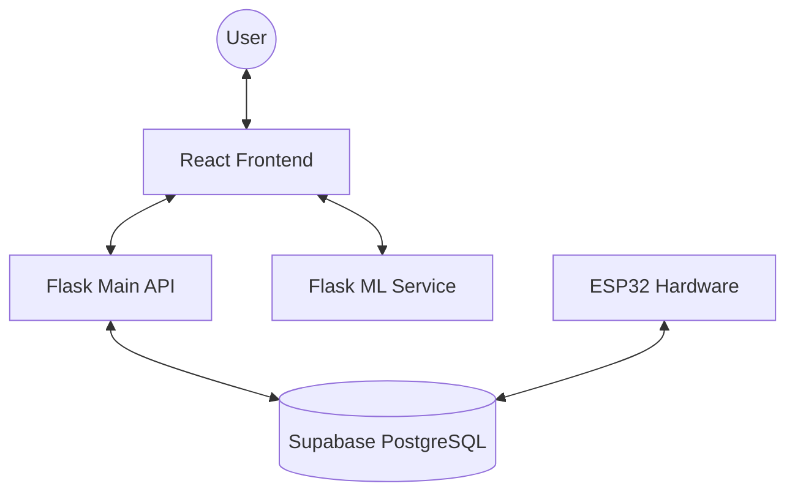

# NutriTech Application Overview

This document describes the architecture, technology stack, and workflow of the NutriTech agricultural sensing and prediction platform.

## Architecture Diagram

---

## Technology Stack

### 1. Frontend (React + Vite)
- **Framework**: React.js
- **Styling**: Tailwind CSS for modern, responsive UI.
- **State Management**: React Hooks (`useState`, `useEffect`).
- **Real-time**: Direct Supabase client integration for live polling of sensor data.
- **Icons**: Google Material Symbols.

### 2. Main Backend (Flask)
- **Language**: Python
- **Database Wrapper**: Supabase Python SDK.
- **Security**: Flask-JWT-Extended (prepared for Auth implementation).
- **Purpose**: Orchestrates experiments, manages physical tub assignments, and interfaces with hardware control tables.

### 3. ML Service (Flask)
- **Logic**: RandomForest Classifier for crop recommendation.
- **Tools**: Scikit-Learn, Pandas, Joblib.
- **Data**: Uses NPK, temperature, humidity, and rainfall to suggest the best crops for the specific soil conditions.

### 4. Database (Supabase / PostgreSQL)
- **Hosting**: Cloud-based PostgreSQL.
- **Features**: Row Level Security (RLS), real-time subscriptions, and multi-schema support (`public` and `experiment`).

---

## Key Workflows

### Experiment Lifecycle
1. **Creation**: User defines a title and number of buckets.
2. **Setup**: User assigns free physical Tubs to the experiment buckets and specifies soil/plant types.
3. **Activation**: Experiment is moved to "Active" status.
4. **Sensing**: 
   - User clicks "Sense Now" on a specific bucket.
   - Backend sets `is_locked = true` in `sensor_status`.
   - ESP32 hardware sees the lock, takes a reading, and writes a new row to `sensor_data`.
   - Frontend polls `sensor_data` and displays the result when it appears.
5. **Completion**: Experiment is ended, and physical tubs are automatically released back into the "Available" pool.

### Crop Prediction
- The platform uses soil readings (N, P, K, pH) combined with environment data (Temp, Humidity, Rainfall).
- The ML Service returns the top 5 most suitable crops along with expected yield and market profit estimations.
